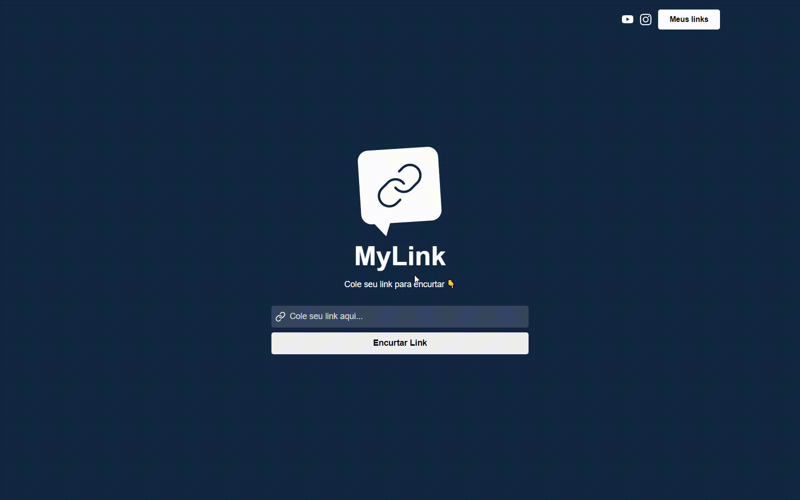

<h1 align="center">MyLink</h1>



> Site para encurtar links e salvá-los no localstorage.

## :page_facing_up: Explicação

O projeto foi desenvolvido utilizando a biblioteca [ReactJS](https://pt-br.reactjs.org/docs/getting-started.html), e a api-localstorage para salvar os links no navegador.

## 🚀 Tecnologias ##

- [ReactJS](https://pt-br.reactjs.org/)
- [React Hooks](https://pt-br.reactjs.org/docs/hooks-intro.html)
- [Axios](https://axios-http.com/ptbr/docs/intro)

## :closed_book: Como usar? ##

Antes de iniciar, você precisa ter [Git](https://git-scm.com) e [Node](https://nodejs.org/en/) instalados.

```bash
# Clone this project
$ git clone https://github.com/antonio-ma-santos/myLink.git
# Access
$ cd mylink
# Install dependencies
$ yarn or npm 
# Run the project
$ yarn start or npm start 
# The server will initialize in the <http://localhost:3000>
```

## 🤝 Colaboradores

Agradecemos às seguintes pessoas que contribuíram para o projeto:

<table>
  <tr>
    <td align="center">
      <a href="#">
        <br>
        <sub>
          <b>Antônio Marcelino</b>
        </sub>
      </a>
    </td>
  </tr>
</table>

&#xa0;

<a href="#top">Voltar para o topo</a>
